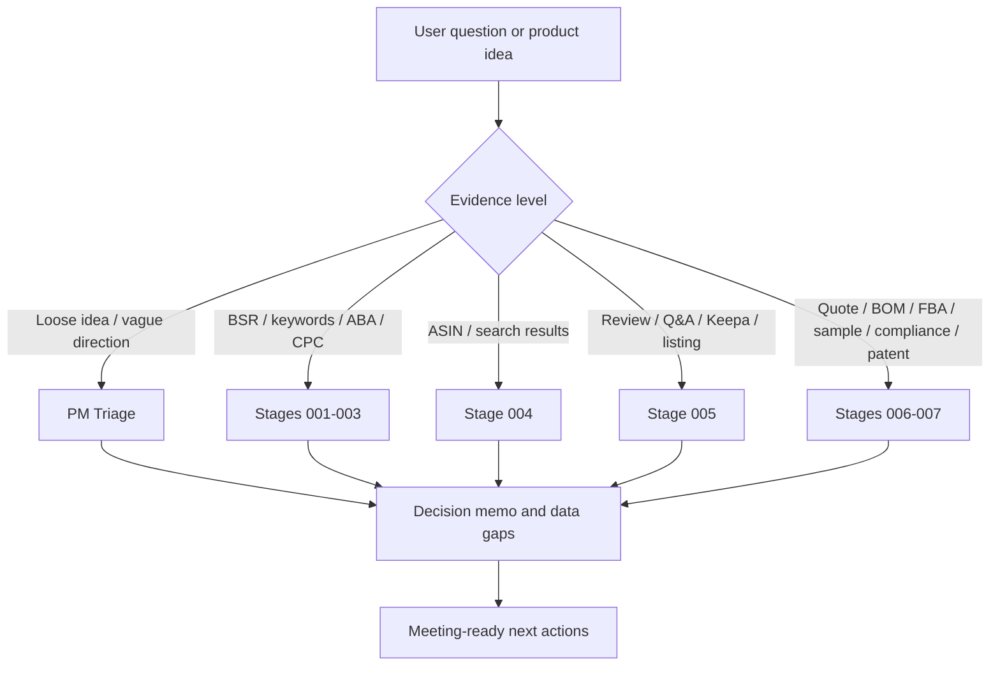

# Amazon PM Integrated Agent

An integrated Amazon product-management agent that routes loose product ideas into PM triage or a structured 000-007 stage-gate research workflow.

这是一个面向 Amazon 选品、产品定义和上会决策的整合型 Agent。它不会替你拍板，而是先判断问题处于哪个产品开发阶段，再选择轻量 PM 判断或完整的 000-007 阶段门工作流，最后输出可验证、可复盘、可继续执行的材料。

## What It Helps With

- 判断一个品类或产品方向是否值得继续深挖。
- 把零散的关键词、BSR、ASIN、Review、报价和合规信息放进正确阶段。
- 区分事实层、判读层、风险层和待决策层，避免过早下结论。
- 为老板汇报、会议讨论、Excel/PPT 交付前整理结构化材料。
- 给出 P0 / P1 / P2 数据缺口和下一步最小验证动作。

## How It Works



## Quick Start

### English

Copy this prompt into your agent runner:

```text
Act as Amazon PM Integrated Agent. First decide whether my input should be handled as lightweight PM triage or routed into the 000-007 stage-gate workflow. Then return facts, interpretation, risks, missing data, and next actions. Do not invent sales, search volume, profit, FBA, compliance, patent, or review conclusions. Label missing evidence as P0/P1/P2.
```

Use this input format:

```text
Marketplace: Amazon US
Product direction: coffee capsule holder
Available evidence: main keywords, several competitor ASINs, partial review observations
Goal: decide whether this category deserves deeper stage-gate research
```

Expected output:

```text
## Summary
## Current Stage
## Known Facts
## Signal Reading
## Risks
## Data Gaps
## Next Actions
## Decisions For Meeting
```

### 中文

Copy this prompt into Codex, ChatGPT, or another agent runner together with `AGENT.md`:

```text
请以 Amazon PM Integrated Agent 的身份工作。先判断我的问题属于轻量 PM 判断还是完整的 000-007 阶段门工作流，再输出事实、判读、风险、数据缺口和下一步动作。不要编造销量、搜索量、利润或评论结论；缺失数据用 P0/P1/P2 标注。
```

Then provide what you already have:

```text
市场：Amazon US
方向：coffee capsule holder
已有资料：主关键词、几个竞品 ASIN、部分 Review 印象
目标：判断是否值得进入完整阶段门工作流
```

## Example Prompts

```text
我在看 coffee capsule holder 这个方向，只有一些关键词和竞品印象。先帮我判断是否值得进入完整阶段门工作流。
```

```text
我已经有 BSR Top100、主关键词、部分竞品 ASIN，请帮我判断现在能跑到哪个阶段，并给出 001-003 的输出框架。
```

```text
我有竞品评论和 Q&A，想做 VOC 产品定义。请按 Stage 005 输出事实层、判读层、风险层和待决策层。
```

## Stage Templates

Reusable prompt templates are available in `templates/`:

| Stage | Template |
| --- | --- |
| 000 | `templates/stage-000-triage.md` |
| 001 | `templates/stage-001-company-fit.md` |
| 002 | `templates/stage-002-demand-trend.md` |
| 003 | `templates/stage-003-market-structure.md` |
| 004 | `templates/stage-004-competitor-map.md` |
| 005 | `templates/stage-005-voc-definition.md` |
| 006 | `templates/stage-006-roi-risk.md` |
| 007 | `templates/stage-007-validation.md` |

## Relationship To Upstream Work

| Project | Role | Status |
| --- | --- | --- |
| [`amazon-product-manager-skill`](https://github.com/ianyoufather-2007/amazon-product-manager-skill) | Core Amazon PM skill and decision framework | Public |
| [`01-product-manager-workflow-agent`](https://github.com/ianyoufather-2007/01-product-manager-workflow-agent) | Lightweight PM workflow wrapper | Public |
| 000-007 stage-gate workflow package | Full internal funnel for market, competitor, VOC, ROI, supply chain, compliance, patent, and sample validation | Not bundled here |
| `amazon-pm-integrated-agent` | Clean routing layer that combines PM triage with stage gates | This repo |

This repository intentionally publishes the clean agent layer, templates, examples, and stage-gate summaries. It does not include private raw data, internal reports, screenshots, supplier quotes, or customer/business records.

## Output Template

```text
## 结论摘要

## 当前阶段判断

## 已有事实

## 信号判读

## 风险与不可逆项

## 数据缺口

| 优先级 | 缺口 | 为什么重要 | 下一步 |
| --- | --- | --- | --- |
| P0 |  |  |  |
| P1 |  |  |  |
| P2 |  |  |  |

## 下一步动作

## 待会议裁定问题
```

## Repository Structure

```text
amazon-pm-integrated-agent/
├── README.md
├── AGENT.md
├── agent.yaml
├── SKILL_INDEX.md
├── templates/
│   ├── stage-000-triage.md
│   ├── stage-001-company-fit.md
│   ├── stage-002-demand-trend.md
│   ├── stage-003-market-structure.md
│   ├── stage-004-competitor-map.md
│   ├── stage-005-voc-definition.md
│   ├── stage-006-roi-risk.md
│   └── stage-007-validation.md
├── docs/
│   ├── workflow-routing.md
│   ├── stage-gates.md
│   └── open-source-cleanup-checklist.md
└── examples/
    ├── anonymized-opportunity-review.md
    ├── anonymized-low-data-triage.md
    ├── anonymized-bsr-asin-stage-run.md
    ├── quick-opportunity-triage.md
    └── stage-run.md
```

## Important Boundaries

- Do not publish raw ASIN exports, Excel/PPT/PDF deliverables, screenshots, cache folders, cookies, sessions, supplier quotes, or private business data.
- Do not use final decision language such as "Go", "Kill", "建议立项", or "不建议立项" unless the user explicitly says the meeting has already made that decision.
- Missing evidence must be marked as P0 / P1 / P2. Do not invent sales, search volume, profit, FBA, compliance, patent, or review conclusions.
- Default output language is Chinese. Default marketplace is Amazon US.

## Disclaimer

This project is a research and decision-support workflow. It does not replace legal, compliance, finance, sourcing, customs, safety testing, patent, or professional marketplace advice.

## License

MIT License. See [LICENSE](LICENSE).
